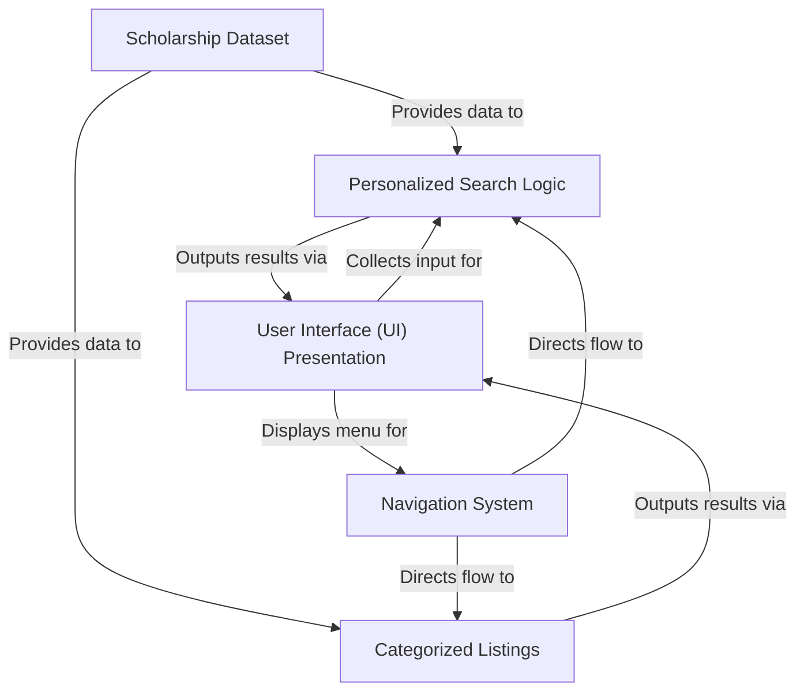
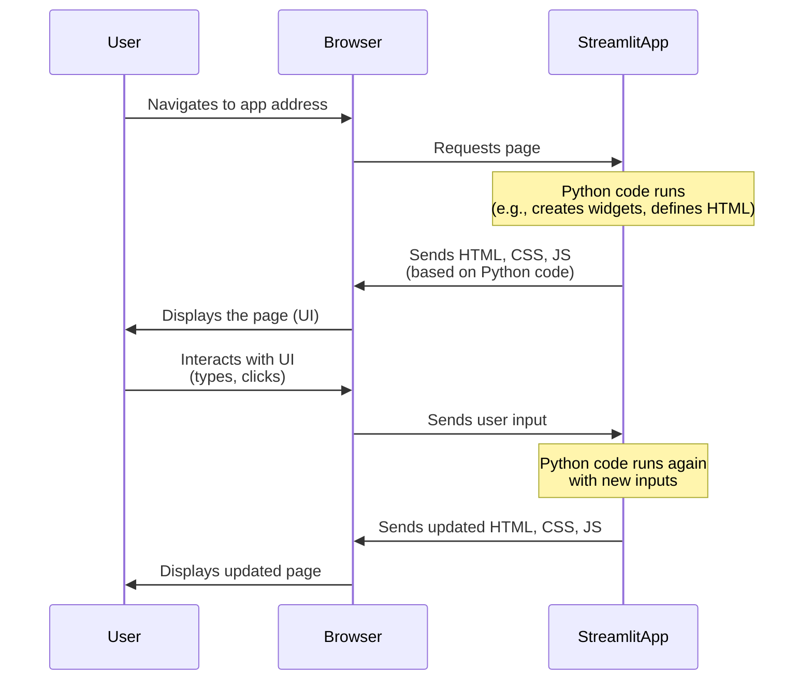
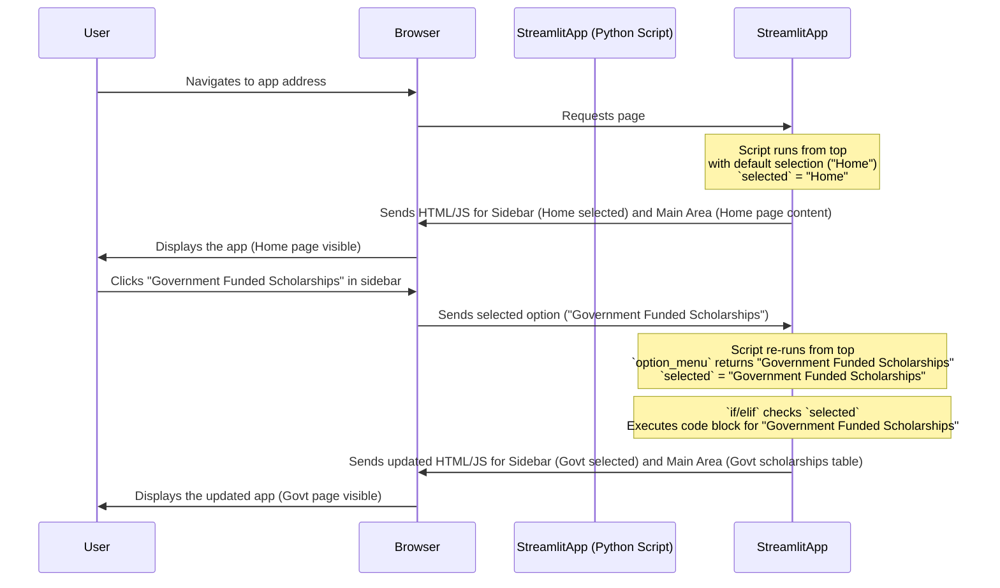
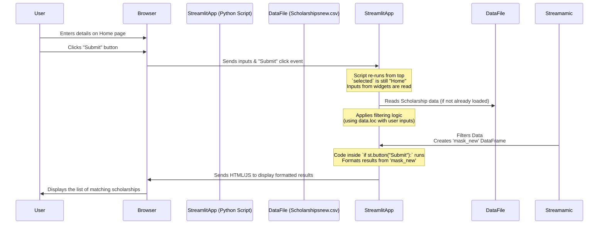
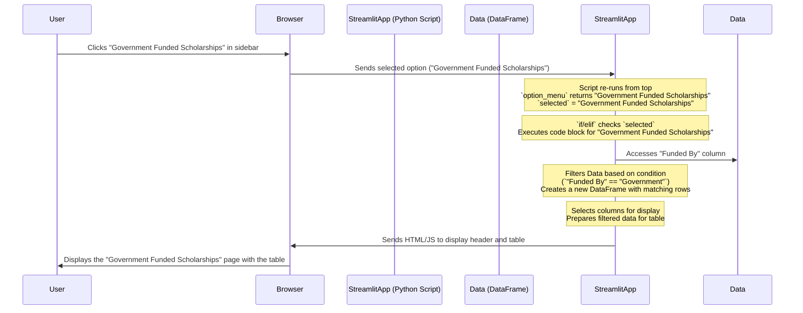
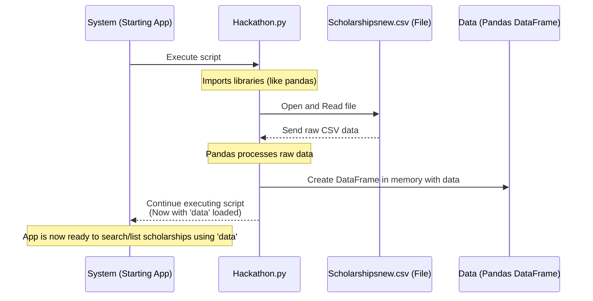

# Scholarship-Finder
Education has become costly. And thus we come up with an idea of “ Scholarship Finder “ where a needy can find a scholarship .Through this one can definitely fulfill their dreams of educating themselves at a lower cost.

Link for the website: https://aagam051-scholarship-finder-hackathon-t5joad.streamlitapp.com/

# Tutorial: Scholarship-Finder

This project is a **Scholarship Finder** application designed to help users find relevant scholarships.
It uses a central *Scholarship Dataset* and allows users to perform *personalized searches* based on their profile details.
It also provides *categorized listings* for browsing scholarships by specific criteria.
The *Navigation System* allows users to switch between finding methods and other sections, all presented through a simple *User Interface*.


## Visual Overview



## Chapters

1. [User Interface (UI) Presentation
](01_user_interface__ui__presentation_.md)
2. [Navigation System
](02_navigation_system_.md)
3. [Personalized Search Logic
](03_personalized_search_logic_.md)
4. [Categorized Listings
](04_categorized_listings_.md)
5. [Scholarship Dataset
](05_scholarship_dataset_.md)

---

<sub><sup>Generated by [AI Codebase Knowledge Builder](https://github.com/The-Pocket/Tutorial-Codebase-Knowledge).</sup></sub>


# Chapter 1: User Interface (UI) Presentation

Welcome to the first chapter of the `Scholarship-Finder` tutorial! In this chapter, we'll start by exploring the very first thing a user sees and interacts with when they run the application: the User Interface, or UI.

Think of the application like a book. The UI is like the *pages* of the book – how the text is formatted, where the pictures are placed, the colors used, and the interactive parts like fill-in-the-blanks sections or buttons you could press (if books had those!). It's how the application visually presents itself to you and allows you to provide information.

**What Problem Does the UI Solve?**

Imagine you want to find scholarships but don't know where to look. The `Scholarship-Finder` app helps with this! But how do you tell the app *what* you're looking for? Do you tell it your income? Your grades? Your gender? This is where the UI comes in. It provides a visual way for you to:

1.  **See information:** Display lists of scholarships, descriptions, amounts, etc.
2.  **Provide information:** Enter your name, select options like your category or gender, input numbers like income or grades.
3.  **Trigger actions:** Click buttons to submit your information and see results.

Without a UI, the application would just be code running behind the scenes – you wouldn't be able to interact with it at all!

**Key Components of the UI**

Our `Scholarship-Finder` UI is built primarily using a Python library called **Streamlit**. Streamlit makes it easy to create interactive web applications with just Python code.

Here’s how Streamlit helps:

*   **Layout:** Streamlit provides functions to place elements on the page, like putting a title at the top, input boxes below it, and a table of results further down.
*   **Widgets:** Streamlit gives us ready-made interactive elements like text boxes (`st.text_input`), radio buttons (`st.radio`), sliders (`st.slider`), buttons (`st.button`), and tables (`st.table`). You just call a function, and Streamlit creates the element!

Let's look at a simple Streamlit example from our code:

```python
import streamlit as st

# Display a header
st.title("Scholarship Finder")

# Ask for user input
name = st.text_input("Enter your Name")
```

This small code snippet, if run as a Streamlit app, would display a large title "Scholarship Finder" and then a text box labeled "Enter your Name" where a user can type. Streamlit handles all the web magic to make this happen!

Besides Streamlit's built-in components, we also use custom **HTML snippets** to add specific styling. HTML (HyperText Markup Language) is the standard language for creating web pages. While Streamlit provides basic styling, using HTML lets us customize things more, like changing text color, size, or background color for specific parts of the page.

Look at this snippet from the code:

```python
html_temp = """
<div style = background-color:purple;padding:5px>
<h1 style="color:yellow;text-align:Center">Scholarships Finder</h1>
</div>
<br>
"""
```

This is an HTML snippet. It defines a `div` (a container) with a purple background and padding. Inside it, there's an `<h1>` tag (a large header) with yellow text centered on the page.

To display this HTML in our Streamlit app, we use `st.markdown`:

```python
st.markdown(html_temp, unsafe_allow_html=True)
```

The `st.markdown` function displays text formatted using Markdown, but by setting `unsafe_allow_html=True`, we tell Streamlit to also interpret raw HTML tags within the text. This is how we apply our custom styling.

**Putting it Together: The Home Page UI**

Let's look at the `Hackathon.py` code to see how these pieces create the UI for the "Home" page.

First, the main header is displayed using the HTML snippet we just saw:

```python
st.markdown(html_temp,unsafe_allow_html=True)
```

Then, Streamlit's input widgets are used to gather information from the user:

```python
name = st.text_input("Enter your Name",placeholder="Name")
# ... other input widgets follow ...
minority = st.radio("Are you in Minorities(SC/ST) category?" ,["Yes","No"],index=1)
disability = st.radio("Do you have any disablity?",["Yes","No"],index=1)
# ... and so on for sports_person, armed_forces, anual_income, marks, gender, nationality
```

Each of these `st.` functions creates a visual element on the page and stores the user's input (what they type or select) into a Python variable (`name`, `minority`, etc.). This is how the application *receives* information from the user through the UI.

Finally, after gathering inputs, a button is displayed:

```python
if st.button("Submit"):
   # Code to display results
   pass # We'll explore the result display later
```

The `st.button` creates a clickable button. The code inside the `if` statement only runs when the user clicks this "Submit" button.

Other pages, like "Government Funded Scholarships", use different Streamlit elements to display information, such as `st.table`:

```python
if selected == "Government Funded Scholarships":
    st.markdown(html_temp5,unsafe_allow_html=True) # Display a styled header
    # ... code to filter data ...
    st.table(govt_funded) # Display the filtered data in a table
```

This `st.table` function takes a data structure (like a Pandas DataFrame, which we'll learn about in [Scholarship Dataset](05_scholarship_dataset_.md)) and automatically draws it as a nice table on the web page.

**How the UI Works Under the Hood (Simplified)**

When you run a Streamlit application, it starts a web server. Your web browser then connects to this server. Here's a very basic flow:



This cycle continues as the user interacts with the app. Streamlit simplifies this complex web development process, allowing us to focus on building the UI and the application logic in Python.

**Code Snippets Explained**

Let's look at the specific parts of the `Hackathon.py` code related to UI presentation:

1.  **Imports:**
    ```python
    import streamlit as st
    from streamlit_option_menu import option_menu
    ```
    We import the `streamlit` library, commonly aliased as `st`, to use its UI functions. We also import `option_menu` for the navigation sidebar (more on this in the next chapter, but it's a UI element!).

2.  **HTML Snippets:**
    ```python
    html_temp = """
    <div style = background-color:purple;padding:5px>
    <h1 style="color:yellow;text-align:Center">Scholarships Finder</h1>
    </div>
    <br>
    """
    # ... other html_temp variables for different headers/styles ...
    ```
    These are Python multi-line strings holding chunks of HTML code. They define how certain text elements will look (colors, sizes, alignment).

3.  **Displaying HTML:**
    ```python
    st.markdown(html_temp,unsafe_allow_html=True)
    ```
    This line uses Streamlit's `markdown` function to render the HTML defined in `html_temp`. `unsafe_allow_html=True` is necessary to tell Streamlit to treat the string as raw HTML. We use similar lines for displaying headers on other pages (`html_temp5` through `html_temp8`, `html_temp11`).

4.  **Input Widgets (Home Page):**
    ```python
    name = st.text_input("Enter your Name",placeholder="Name")
    # ...
    minority = st.radio("Are you in Minorities(SC/ST) category?" ,["Yes","No"],index=1)
    # ...
    anual_income = st.number_input("Enter your family's annual income",max_value=1100000)
    # ...
    marks = st.slider("Enter your marks in last final examination",min_value=0,max_value=100,value=30,step=1)
    # ...
    gender = st.selectbox("Enter your gender:",["Male","Female"])
    # ...
    if st.button("Submit"):
       # ... code runs when button is clicked
       pass
    ```
    These are the core Streamlit functions that create interactive elements for the user to provide data. `st.text_input` creates a text box, `st.radio` creates radio buttons, `st.number_input` creates a box for numbers, `st.slider` creates a drag-able slider, `st.selectbox` creates a dropdown menu, and `st.button` creates a clickable button.

5.  **Displaying Data (Other Pages):**
    ```python
    st.table(govt_funded)
    ```
    On pages like "Government Funded Scholarships", "Private Funded Scholarships", etc., after filtering the data (a step we'll cover in later chapters like [Personalized Search Logic](03_personalized_search_logic_.md) and [Categorized Listings](04_categorized_listings_.md)), this line displays the resulting data in a formatted table.

The sidebar navigation, seen at the very top of the `MAIN CODE` section, is also part of the UI. It uses the `streamlit_option_menu` library to create a visually appealing menu, handled within a `with st.sidebar:` block. We'll discuss the *logic* of navigation in the next chapter, but visually, this sidebar is another key UI element created using a library compatible with Streamlit.

**Conclusion**

In this chapter, we learned that the User Interface (UI) is how our application looks and how users interact with it. We saw that the `Scholarship-Finder` uses the Streamlit library to create standard interactive elements like text boxes, buttons, and tables, and incorporates custom HTML snippets for specific styling needs like changing header colors. You saw how these elements come together to form the visible parts of the application, especially on the "Home" page where users input their information and on other pages where data is displayed in tables.

The UI is like the visible skin of the application. But how does clicking those buttons or selecting options change *what* the user sees or *what* information is displayed? That leads us to the application's navigation system.

Ready to learn how different parts of the app are connected and how clicking on the sidebar menu changes the page content? Let's move on!

[Next Chapter: Navigation System](02_navigation_system_.md)

---

<sub><sup>Generated by [AI Codebase Knowledge Builder](https://github.com/The-Pocket/Tutorial-Codebase-Knowledge).</sup></sub> <sub><sup>**References**: [[1]](https://github.com/Aagam051/Scholarship-Finder/blob/5fd58b66debe5e9150145360c8faab769eb5ce03/Hackathon.py)</sup></sub>

# Chapter 2: Navigation System

Welcome back! In [Chapter 1: User Interface (UI) Presentation](01_user_interface__ui__presentation_.md), we learned how the `Scholarship-Finder` app presents information and takes input from the user – think of it as understanding the *look* of the pages and the interactive elements on them.

But an application often has more than one "page" or section. How do you move from the main input screen to a list of government scholarships or an "About Us" page? This is where the **Navigation System** comes in.

**What Problem Does the Navigation System Solve?**

Imagine the `Scholarship-Finder` app as a book with different sections:

*   A section where you tell the book about yourself (your details).
*   A section listing government scholarships.
*   A section listing private scholarships.
*   A section about the authors (the "About Us" page).

Without a table of contents or an index, you'd have to flip through every page to find the section you want! That would be frustrating and slow.

The **Navigation System** is like the book's table of contents or a website's menu bar. It provides a clear, easy way for users to:

1.  See what sections (or "pages") are available in the application.
2.  Quickly jump directly to the section they are interested in.

It guides the user through the different functionalities the app offers.

**Key Components of the Navigation System**

Our `Scholarship-Finder` app uses a common pattern for web applications: a sidebar menu. This menu is powered by a helpful library called `streamlit_option_menu`.

Here's how it works:

*   **Sidebar:** Streamlit allows you to create a separate area on the left side of the window called the sidebar. This is perfect for persistent navigation elements that should always be visible.
*   **`streamlit_option_menu`:** This library provides a function (`option_menu`) that makes it easy to create a stylish and interactive menu *within* the sidebar. It automatically handles the visual appearance and tells us *which* menu item the user clicked.
*   **Application Logic:** Based on *which* item the user selected from the menu, the main part of the application window changes to display the content relevant to that selection.

**Using the Navigation System (The User's View)**

When you run the `Scholarship-Finder` app, you'll see a menu on the left side of the screen. It looks something like this:

```
☰ Navigation
---
🏠 Home
🧭 About Us
✉️ Government Funded Scholarships
🌍 Private Funded Scholarships
♀️ Scholarship for Women
🎓 International Scholarships
```
(The exact look and icons might vary slightly depending on your browser and Streamlit version, but the structure is the same).

When you click on one of these options (e.g., "Government Funded Scholarships"), the content in the main part of the window updates to show only the information for government scholarships. The menu stays visible in the sidebar, allowing you to switch sections again easily.

**Implementing the Navigation System in Code**

Let's look at the relevant code snippets from `Hackathon.py` to see how this navigation is created and how it controls the displayed content.

**1. Creating the Sidebar Menu:**

First, we need to tell Streamlit that we want to put something in the sidebar. We do this using a `with st.sidebar:` block.

```python
import streamlit as st
from streamlit_option_menu import option_menu

# ... other code ...

with st.sidebar:
    selected = option_menu(
        menu_title="Navigation", # Title above the menu
        options=["Home","About Us","Government Funded Scholarships", # The list of menu items
                 "Private Funded Scholarships","Scholarship for Women","International Scholarships"],
        icons=["house","compass","envelope","geo","gender-female","mortarboard-fill"], # Icons for each item (optional)
        default_index=0, # Which item is selected by default (Home)
        menu_icon="cast", # Icon for the menu title itself (optional)
        orientation="horizontal" # How options are displayed (horizontal in sidebar means listed vertically)
    )

# --------------------------------------------------------------------------------------------------------------------------------------------------------------
# This block ends, anything outside this block is in the main part of the page by default
# --------------------------------------------------------------------------------------------------------------------------------------------------------------
```

**Explanation:**

*   `import streamlit as st` and `from streamlit_option_menu import option_menu`: We import the necessary libraries.
*   `with st.sidebar:`: This block tells Streamlit to place everything inside it into the left sidebar.
*   `selected = option_menu(...)`: This calls the function to create the menu.
    *   `menu_title="Navigation"`: Sets the text shown at the top of the sidebar menu.
    *   `options=[...]`: This is a list of strings. Each string in this list becomes a clickable item in the menu. The order matters!
    *   `icons=[...]`: A list matching the `options` list, providing icons for each menu item.
    *   `default_index=0`: Says that the *first* item in the `options` list ("Home", which is at index 0) should be selected when the app first loads.
    *   `menu_icon="cast"`: An icon for the main title.
    *   `orientation="horizontal"`: In the sidebar, `horizontal` actually makes the list appear vertically (stacked). If this were in the main body, `horizontal` would show the options side-by-side.
*   **Crucially:** The `option_menu` function *returns* the string of the menu item that the user clicked (or the `default_index` item when the app starts). We store this returned string in a variable called `selected`. This `selected` variable is the key to our navigation logic!

**2. Displaying Content Based on Selection:**

After the sidebar menu is set up and the `selected` variable holds the name of the chosen option, the rest of the application's main code uses simple `if` and `elif` (else if) statements to decide what to display.

```python
# This code is OUTSIDE the with st.sidebar: block

if selected == "Home":
    # Code to display the Home page content (inputs, submit button, results area)
    st.markdown(html_temp,unsafe_allow_html=True)
    name = st.text_input("Enter your Name",placeholder="Name")
    # ... rest of Home page UI elements and logic ...

elif selected == "Government Funded Scholarships":
    # Code to display the Government Funded Scholarships page content (header, table)
    st.markdown(html_temp5,unsafe_allow_html=True)
    # ... code to filter data ...
    st.table(govt_funded) # Display the table of results

elif selected == "Private Funded Scholarships":
    # Code to display the Private Funded Scholarships page content
    st.markdown(html_temp6,unsafe_allow_html=True)
    # ... code to filter data ...
    st.table(prvt_funded)

# ... and so on for "Scholarship for Women", "International Scholarships", and "About Us" ...

elif selected == "About Us":
    # Code to display the About Us page content (headers, images, links)
    st.markdown(html_temp11,unsafe_allow_html=True)
    # ... display team info and quotes ...
```

**Explanation:**

*   The code checks the value stored in the `selected` variable.
*   If `selected` is exactly `"Home"`, the code block under `if selected == "Home":` runs. This block contains all the Streamlit code needed to draw the elements for the Home page (title, text inputs, radio buttons, slider, button, etc., as discussed in [Chapter 1](01_user_interface__ui__presentation_.md)).
*   If `selected` is not `"Home"`, it checks the next condition: `elif selected == "Government Funded Scholarships":`. If this is true, the code block under it runs. This block displays the specific header for this page and a table containing only government scholarships. (We'll cover how the data is filtered in [Chapter 4: Categorized Listings](04_categorized_listings_.md)).
*   This pattern continues for every option in the sidebar menu. Only the code block corresponding to the `selected` item is executed on each run of the script.

**How the Navigation Works Under the Hood (Simplified)**

Remember from [Chapter 1](01_user_interface__ui__presentation_.md) that Streamlit re-runs the entire script from top to bottom whenever a user interacts with a widget (like clicking a button or selecting a menu item). This re-run mechanism is fundamental to how the navigation works.



Every time you click a sidebar item:

1.  The browser tells the Streamlit server *which* item was clicked.
2.  Streamlit triggers a *complete re-run* of the `Hackathon.py` script.
3.  The `option_menu` function runs again, detects the user's choice, and returns the corresponding string (e.g., "Government Funded Scholarships"). This value is saved in the `selected` variable.
4.  The `if/elif` structure checks the new value of `selected` and executes *only* the code block associated with that value. All other blocks are skipped.
5.  Streamlit generates the HTML/JavaScript for the UI based *only* on the executed code block and sends it back to the browser.

This re-run and conditional execution (`if/elif`) is how Streamlit applications switch between different views or states.

**Code Snippets Revisited**

Looking back at the `Hackathon.py` code provided:

*   The lines within the `with st.sidebar:` block define the navigation menu itself. The `option_menu` function is the core of this.
*   The large block of `if selected == "Home": ... elif selected == "Government Funded Scholarships": ... elif selected == "Private Funded Scholarships": ...` and so on, implements the switching logic. Everything inside the block corresponding to the `selected` value is displayed, and everything else is hidden because its code simply isn't run during that specific script execution.
*   Notice that the data loading (`data = pd.read_csv("Scholarshipsnew.csv")`) happens *before* the navigation logic. This is efficient because the data is loaded only once when the script starts (on the very first run or after certain code changes). The data then remains available in memory for filtering and display, no matter which navigation option is selected.

**Conclusion**

In this chapter, we've learned that the Navigation System is crucial for allowing users to move between different sections of our application. We saw how `streamlit_option_menu` is used within Streamlit's sidebar to create an interactive menu. Most importantly, we understood that the value returned by `option_menu` (`selected`) is used in `if/elif` statements in the main part of the code to determine *which* set of UI elements and logic should be displayed to the user. This simple pattern of sidebar menu + `selected` variable + `if/elif` conditions is a powerful way to structure multi-page applications in Streamlit.

Now that we know how to navigate between the main "Home" page (where users input details) and the category pages (which list scholarships), we need to understand how the "Home" page takes the user's specific inputs (like income, marks, category) and finds the *most relevant* scholarships *just for them*.

Ready to see how the app uses user input to personalize the search? Let's move on!

[Next Chapter: Personalized Search Logic](03_personalized_search_logic_.md)

---

<sub><sup>Generated by [AI Codebase Knowledge Builder](https://github.com/The-Pocket/Tutorial-Codebase-Knowledge).</sup></sub> <sub><sup>**References**: [[1]](https://github.com/Aagam051/Scholarship-Finder/blob/5fd58b66debe5e9150145360c8faab769eb5ce03/Hackathon.py)</sup></sub>

# Chapter 3: Personalized Search Logic

Welcome back, future scholar! In [Chapter 1: User Interface (UI) Presentation](01_user_interface__ui__presentation_.md), we explored how the `Scholarship-Finder` app looks and how you interact with it using buttons, text boxes, and menus. In [Chapter 2: Navigation System](02_navigation_system_.md), we learned how the sidebar menu helps you jump between different sections of the app, like going from the "Home" page to the "Government Funded Scholarships" list.

Now, let's dive into the really smart part of the app, specifically on the "Home" page: the **Personalized Search Logic**.

**What Problem Does Personalized Search Logic Solve?**

Imagine the `Scholarship-Finder` app has a giant library filled with information about *every single scholarship* available. That's a lot of data! If the app just showed you the entire list, you'd have to read through thousands of scholarships to find the few that you might actually be eligible for. That would take ages!

The **Personalized Search Logic** solves this problem. It's like having a super-efficient librarian who acts as your personal assistant. Instead of giving you the whole library catalog, this assistant first asks you specific questions about yourself:

*   What are your grades like?
*   What is your family's income?
*   Are you in a minority group?
*   What is your gender?
*   And so on...

Based on your answers, the assistant goes into the library and pulls out *only* the scholarship details that perfectly match your criteria. This saves you a huge amount of time and shows you scholarships that are relevant *to you*.

In our app, this logic is the core intelligence on the "Home" page that uses the information you provide in the input forms to find matching scholarships from the main list.

**The Use Case: Finding Scholarships Just For You**

Let's focus on the main task on the "Home" page:

1.  You fill in your details using the text boxes, radio buttons, slider, and dropdown menu (like your income, marks, gender, etc.).
2.  You click the "Submit" button.
3.  The app processes your information.
4.  Instead of showing you everything, the app displays a list of scholarships that *match the criteria you entered*.

This is the Personalized Search in action!

**Key Concepts**

To understand how this works, let's break it down into a few key parts:

1.  **Gathering User Input:** Getting the details *from you*.
2.  **The Scholarship Dataset:** The big list of *all* scholarships the app knows about.
3.  **Filtering the Dataset:** Comparing your input to the big list and picking out the matches.
4.  **Displaying Results:** Showing you the list of scholarships that were found.

**1. Gathering User Input**

We saw this in [Chapter 1](01_user_interface__ui__presentation_.md). On the "Home" page, Streamlit widgets collect your information:

```python
# From Hackathon.py (simplified)
name = st.text_input("Enter your Name")
minority = st.radio("Are you in Minorities(SC/ST) category?" ,["Yes","No"],index=1)
# ... other inputs ...
anual_income = st.number_input("Enter your family's annual income",max_value=1100000)
marks = st.slider("Enter your marks in last final examination",min_value=0,max_value=100,value=30,step=1)
gender = st.selectbox("Enter your gender:",["Male","Female"])
nationality = st.radio("Do you want to include International Scholarships",["Yes","No"])
```

When you interact with these widgets, the values you enter or select are stored in Python variables like `minority`, `anual_income`, `marks`, etc. These variables hold *your specific criteria*.

**2. The Scholarship Dataset**

Before the app can find matching scholarships, it needs a list of all the scholarships it knows about. This list is stored in a file called `Scholarshipsnew.csv` and loaded into a data structure called a Pandas DataFrame (we'll talk much more about this in [Chapter 5: Scholarship Dataset](05_scholarship_dataset_.md)).

Think of the DataFrame as a table, similar to a spreadsheet, with rows representing individual scholarships and columns representing details like "Scholarship Name", "Annual Income", "Gender", "Country", etc.

```python
# From Hackathon.py (near the top)
import pandas as pd # Need this library to work with DataFrames

data = pd.read_csv("Scholarshipsnew.csv") # Load the data into the 'data' variable
```

So, the `data` variable now holds our big library catalog of scholarships.

**3. Filtering the Dataset**

This is where the magic happens! The app takes your input (stored in variables) and uses it to filter the `data` DataFrame. Filtering means creating a *new*, smaller table that contains *only* the rows (scholarships) that meet specific conditions based on your input.

Let's look at the core filtering code on the "Home" page (within the `if selected == "Home":` block):

```python
# From Hackathon.py (simplified filtering logic)

# Check gender first, as some scholarships are only for women
if gender == "Female":
    # If user is Female, match based on all inputs, including if they want International AND gender is 'Yes' OR 'No' in the data
    # (The data has 'Gender' as 'Yes' for Women-specific, 'No' for open to all)
    if nationality == "Yes":
        mask = data.loc[
            (data["Minorities"] == minority) &
            (data["Annual Income"] >= anual_income ) & # Income must be greater than OR equal to annual income required by scholarship
            (data["Disablities"] == disability) &
            (data["Armed Forces"] == armed_forces) &
            (data["Sports Person"] == sports_person) &
            (data["Grades in Prev Exam"] <= marks) # Your marks must be greater than OR equal to the minimum required by scholarship
        ]
    else: # If user is Female and DOES NOT want International
        mask = data.loc[
            (data["Minorities"] == minority) &
            (data["Annual Income"] >= anual_income ) &
            (data["Disablities"] == disability) &
            (data["Armed Forces"] == armed_forces) &
            (data["Sports Person"] == sports_person) &
            (data["Grades in Prev Exam"] <= marks) &
            (data["Country"] == "India") # Also filter for only Indian scholarships
        ]
else: # If user is Male
    # Match based on all inputs, but filter for scholarships NOT marked "Gender: Yes" (since those are women-specific)
    if nationality == "Yes":
        mask = data.loc[
            (data["Minorities"] == minority) &
            (data["Annual Income"] >= anual_income ) &
            (data["Disablities"] == disability) &
            (data["Armed Forces"] == armed_forces) &
            (data["Sports Person"] == sports_person) &
            (data["Grades in Prev Exam"] <= marks) &
            (data["Gender"] == "No") # Filter out women-specific scholarships
        ]
    else: # If user is Male and DOES NOT want International
         mask = data.loc[
            (data["Minorities"] == minority) &
            (data["Annual Income"] >= anual_income ) &
            (data["Disablities"] == disability) &
            (data["Armed Forces"] == armed_forces) &
            (data["Sports Person"] == sports_person) &
            (data["Grades in Prev Exam"] <= marks) &
            (data["Gender"] == "No") & # Filter out women-specific
            (data["Country"] == "India") # Also filter for only Indian
        ]

# After filtering, 'mask' is a new DataFrame with only the matching scholarships
mask_new = mask[["Scholarship Name" , "Amount Provided","Link" ,"Funded By"]] # Select only these columns for display
```

**Explanation:**

*   `data.loc[...]`: This is the core Pandas command for selecting rows from the `data` DataFrame based on conditions.
*   `(data["Minorities"] == minority)`: This is one condition. It checks each row in the `data` DataFrame and asks, "Does the value in the 'Minorities' column for this row match the value the user entered (`minority`)?". It creates a True/False result for each row.
*   `(data["Annual Income"] >= anual_income )`: This condition checks if the "Annual Income" required by the scholarship (in the data) is *greater than or equal to* the user's entered `anual_income`. **Wait, this seems backward!** Looking closely at the code, it uses `>=`. This likely means the `Annual Income` column in the CSV actually represents the *maximum* allowed family income for that scholarship. So, the condition `data["Annual Income"] >= anual_income` checks if the scholarship's *maximum allowed income* is greater than or equal to *your family's income*. This is correct filtering! If a scholarship allows up to 5 lakh, and your income is 4 lakh, `5 lakh >= 4 lakh` is True. If your income is 6 lakh, `5 lakh >= 6 lakh` is False.
*   `(data["Grades in Prev Exam"] <= marks)`: This condition checks if the "Grades in Prev Exam" required by the scholarship is *less than or equal to* your `marks`. **Again, seems backward?** Let's assume the `Grades in Prev Exam` column in the CSV represents the *minimum percentage required* for that scholarship. So, the condition `data["Grades in Prev Exam"] <= marks` checks if the scholarship's *minimum required percentage* is less than or equal to *your percentage*. This is also correct filtering! If a scholarship requires 70%, and your marks are 75%, `70% <= 75%` is True. If your marks are 65%, `70% <= 65%` is False.
*   `(condition1) & (condition2) & ...`: The `&` symbol means "AND". All the conditions linked by `&` must be True for a row (scholarship) to be included in the filtered result. This is how the app ensures that a scholarship matches *all* your criteria.
*   `if gender == "Female": ... else: ...`: This handles a specific rule. Scholarships in the data marked with `data["Gender"] == "Yes"` are only for women. If the user is Male (`gender == "Male"`), the app adds the condition `(data["Gender"] == "No")` to the filter to exclude these women-specific scholarships. If the user is Female (`gender == "Female"`), this extra gender filter is not needed in the same way; the original code structure here is a bit simplified, but the intent is to include scholarships where `Gender` is "No" (open to all) or potentially where `Gender` is "Yes" if the user is female (though the code provided only explicitly excludes "Yes" for males).
*   `if nationality == "Yes": ... else: ...`: This handles the "International Scholarships" preference. If the user says "No" to international scholarships, the app adds the condition `(data["Country"] == "India")` to the filter.
*   `mask = ...`: The result of applying these conditions is a new DataFrame called `mask`, containing only the rows (scholarships) that matched.
*   `mask_new = mask[["Scholarship Name" , "Amount Provided","Link" ,"Funded By"]]`: Finally, from the filtered `mask` DataFrame, we select only the columns we want to show the user.

**4. Displaying Results**

After the filtering is done and we have the `mask_new` DataFrame containing the relevant scholarships, the app needs to display them. This happens inside the `if st.button("Submit"):` block, which only runs when you click the "Submit" button.

```python
# From Hackathon.py (inside the if st.button("Submit"): block)

# Prepare the filtered data for display
mask_new = mask[["Scholarship Name" , "Amount Provided","Link" ,"Funded By"]]
rows = mask_new.shape[0] # Get the number of matching scholarships
a = [] # Create an empty list to hold formatted scholarship details

# Loop through each matching scholarship row
for i in range(rows):
    # Format the details nicely using f-strings
    a.append(f"{ mask_new.iloc[i,0] } : {mask_new.iloc[i,1]} Rs") # Add Name and Amount
    a.append(f"{ mask_new.iloc[i,2] }") # Add the Link
    a.append("-------------------------------------------") # Add a separator

# Now, loop through the prepared list 'a' and display each item
for i in range(len(a)):
    if(i%3==0): # If it's the first item (Scholarship Name), use a larger/different style
        st.markdown(html_temp3.format(a[i]),unsafe_allow_html=True)
    else: # Otherwise (Link or separator), use a smaller/different style
        st.markdown(html_temp4.format(a[i]),unsafe_allow_html=True)
```

**Explanation:**

*   `mask_new.shape[0]`: Gets the number of rows in the filtered DataFrame, telling us how many scholarships were found.
*   The first `for` loop iterates through each row of the `mask_new` DataFrame.
*   `mask_new.iloc[i,0]`: Accesses the data in the `i`-th row, 0-th column ("Scholarship Name").
*   `f"{...} : {...} Rs"`: Uses f-strings to format the output into a readable string like "Scholarship A : 50000 Rs".
*   The details (Name/Amount, Link, and a separator) are added one by one into the list `a`.
*   The second `for` loop then goes through the list `a`.
*   `i%3==0`: This checks if the index `i` is a multiple of 3 (0, 3, 6, ...). In our list `a`, the Name/Amount is the 0th element, the Link is the 1st, the separator is the 2nd, the next Name/Amount is the 3rd, and so on. So this condition identifies the lines containing the Scholarship Name and Amount.
*   `st.markdown(html_temp3.format(a[i]),unsafe_allow_html=True)`: If it's a Name/Amount line, it uses the HTML template `html_temp3` (which provides specific styling) to display it.
*   `st.markdown(html_temp4.format(a[i]),unsafe_allow_html=True)`: For Link and separator lines, it uses the HTML template `html_temp4` for a different style.

This is how the app takes the filtered results and presents them nicely formatted to the user.

**How it Works Under the Hood (Simplified)**

Let's trace the process from the user's perspective when they click "Submit" on the Home page:



When you click "Submit", Streamlit re-runs the entire script. Because the `selected` variable (from navigation) is "Home", the code block for the "Home" page is executed. This block first gets all the current values from the input widgets. Then, it uses these values in the `data.loc[...]` filtering command to create a new DataFrame containing *only* the scholarships that meet all criteria. Finally, because the `st.button("Submit")` condition is now true, the code inside that `if` block executes, which formats and displays the results from the filtered DataFrame using `st.markdown`.

**Code Snippets Revisited**

Here are the key parts in `Hackathon.py` related to Personalized Search Logic:

1.  **Data Loading:**
    ```python
    data = pd.read_csv("Scholarshipsnew.csv")
    ```
    Loads the entire dataset, usually happens once at the beginning.

2.  **Input Widgets (on Home page, within `if selected == "Home":`):**
    ```python
    name = st.text_input(...)
    minority = st.radio(...)
    # ... all other inputs ...
    ```
    These capture user-specific criteria into Python variables.

3.  **Filtering Logic (on Home page, within `if selected == "Home":`):**
    ```python
    if gender == "Female":
        # ... filtering conditions combining user inputs with data columns using & ...
        mask = data.loc[...]
    else:
        # ... slightly different filtering conditions ...
        mask = data.loc[...]

    mask_new = mask[["Scholarship Name" , "Amount Provided","Link" ,"Funded By"]]
    ```
    This is the core of the personalized search, using `data.loc` with multiple conditions linked by `&`.

4.  **Displaying Results (on Home page, within `if selected == "Home":` AND `if st.button("Submit"):`):**
    ```python
    # ... code to loop through mask_new and format results into list 'a' ...
    for i in range(len(a)):
        st.markdown(html_temp3.format(a[i]),unsafe_allow_html=True) # or html_temp4
    ```
    This takes the filtered data and presents it on the page using formatted text.

**Conclusion**

In this chapter, we've seen how the `Scholarship-Finder` app moves beyond just displaying information to actively helping you find what you need. The **Personalized Search Logic** on the "Home" page is the core intelligence that takes your specific details entered through the UI (Chapter 1) and uses them to filter the entire scholarship dataset (Chapter 5) to show you only the most relevant options. We explored how Pandas DataFrames are used for filtering with conditions based on user input and how the results are then formatted and displayed.

This personalized search is one way the app filters the data. Another way is simply by showing predefined categories like "Government Funded" or "Scholarship for Women", which we navigate to using the system discussed in Chapter 2.

Ready to see how the app shows you these broad categories of scholarships? Let's move on!

[Next Chapter: Categorized Listings](04_categorized_listings_.md)

---

<sub><sup>Generated by [AI Codebase Knowledge Builder](https://github.com/The-Pocket/Tutorial-Codebase-Knowledge).</sup></sub> <sub><sup>**References**: [[1]](https://github.com/Aagam051/Scholarship-Finder/blob/5fd58b66debe5e9150145360c8faab769eb5ce03/Hackathon.py)</sup></sub>

# Chapter 4: Categorized Listings

Welcome back, future scholar! In [Chapter 3: Personalized Search Logic](03_personalized_search_logic_.md), we learned how the "Home" page of our `Scholarship-Finder` app takes *your specific details* (like income, marks, gender) and filters the huge list of scholarships to find the ones that are most relevant *to you*. That's like asking a librarian for books that match *all* your personal interests.

But sometimes, you don't have a super specific request. Maybe you just want to see *all* the books in the "Science Fiction" section, or *all* the books by your favourite author, without giving the librarian a whole list of your preferences.

This is where **Categorized Listings** come in!

**What Problem Do Categorized Listings Solve?**

Imagine the `Scholarship-Finder` app's dataset is a massive library, just like before. The Personalized Search helps you find books *just for you*. But the library also has shelves already organized by popular topics, like:

*   "Government Funded Scholarships"
*   "Scholarships for Women"
*   "International Scholarships"
*   "Private Funded Scholarships"

These shelves are already curated – someone has gone through the main library and placed copies of the relevant books on these specific shelves. You can walk directly to the "Scholarships for Women" shelf and browse *all* the scholarships that fit that category, without having to enter your own gender or other details.

**Categorized Listings** in our app provide these pre-filtered "shelves". They are sections of the app (accessed via the sidebar menu, as we saw in [Chapter 2: Navigation System](02_navigation_system_.md)) that show lists of scholarships based on one fixed, specific characteristic, rather than a combination of user inputs.

**The Use Case: Browsing by Category**

Let's focus on a simple use case: viewing all Government Funded Scholarships.

1.  You open the app.
2.  You see the navigation sidebar.
3.  You click on "Government Funded Scholarships".
4.  The app displays a list (a table) containing *all* the scholarships from the main dataset that are funded by the government.

You didn't have to enter your income, marks, or anything else. You just chose a category, and the app showed you everything in that category.

**Key Concepts**

To create these categorized lists, the app needs to:

1.  **Identify the Category:** Know which category the user selected from the menu (e.g., "Government Funded Scholarships").
2.  **Define the Filter:** Know the *fixed rule* for that category (e.g., for "Government Funded", the rule is "Funded By must equal 'Government'").
3.  **Apply the Filter:** Use the fixed rule to select relevant scholarships from the main dataset.
4.  **Display the Results:** Present the filtered list, typically in a readable table format.

**Implementing Categorized Listings in Code**

Let's look at how this works in the `Hackathon.py` code, focusing on the different sections triggered by the navigation sidebar.

Remember from [Chapter 2](02_navigation_system_.md) that the `selected` variable holds the name of the menu item you clicked. The app then uses `if`/`elif` statements to decide which section of code to run.

Here's the code for the "Government Funded Scholarships" section:

```python
# From Hackathon.py (within the main code block, after the sidebar definition)

elif selected == "Government Funded Scholarships": # Check if this menu item was selected
    # Display a header for this section
    st.markdown(html_temp5,unsafe_allow_html=True)

    # --- CONCEPT: Define and Apply the Filter ---
    # Create a condition: Is the value in the "Funded By" column equal to "Government"?
    new = data["Funded By"] == "Government"

    # Apply the condition to the main data DataFrame
    govt_funded = data[new]

    # --- CONCEPT: Select Columns and Display Results ---
    # Keep only the columns we want to show
    govt_funded = govt_funded[["Scholarship Name" , "Amount Provided","Link"]]

    # Display the filtered data in a table
    st.table(govt_funded)
```

**Explanation:**

1.  `elif selected == "Government Funded Scholarships":`: This line checks if the user clicked the "Government Funded Scholarships" option in the sidebar. If they did, the code block below this line is executed.
2.  `st.markdown(html_temp5,unsafe_allow_html=True)`: This simply displays the purple/yellow header specific to this section, making it clear which page you are viewing.
3.  `new = data["Funded By"] == "Government"`: This is the core filtering step for this specific category!
    *   `data["Funded By"]`: Selects the entire "Funded By" column from our main scholarship dataset (`data`).
    *   `== "Government"`: Compares each value in that column to the string `"Government"`.
    *   The result is a **Series** (a single column of data, similar to a list) of `True` and `False` values. For every scholarship row where the "Funded By" is exactly "Government", it's `True`. For all others, it's `False`. This `True`/`False` list is stored in the variable `new`.
4.  `govt_funded = data[new]`: This line uses the `True`/`False` Series (`new`) to filter the original `data` DataFrame. Pandas is smart: when you put a list/Series of True/False inside the square brackets `[]` after a DataFrame name (`data[new]`), it returns a **new DataFrame** (`govt_funded`) containing **only the rows** where the corresponding value in the `new` Series was `True`. This `govt_funded` DataFrame now holds *only* government-funded scholarships.
5.  `govt_funded = govt_funded[["Scholarship Name" , "Amount Provided","Link"]]`: From the `govt_funded` DataFrame (which still has *all* columns like "Annual Income", "Gender", etc.), we select *only* the columns we want to display to the user: "Scholarship Name", "Amount Provided", and "Link". This makes the table cleaner and easier to read. The result is stored back into `govt_funded`.
6.  `st.table(govt_funded)`: This is a simple but powerful Streamlit function. It takes the `govt_funded` DataFrame and automatically draws it as a nicely formatted table on the web page.

**Another Example: Scholarship for Women**

Let's look at the code for the "Scholarship for Women" category:

```python
# From Hackathon.py

elif selected == "Scholarship for Women": # Check if this menu item was selected
    # Display the header
    st.markdown(html_temp7,unsafe_allow_html=True)

    # --- CONCEPT: Define and Apply the Filter (different rule) ---
    # Create a condition: Is the value in the "Gender" column equal to "Yes"?
    # (In our dataset, "Gender" == "Yes" means "Specifically for Women")
    new_3 = data["Gender"] == "Yes"

    # Apply the condition to the main data DataFrame
    women_funded = data[new_3]

    # --- CONCEPT: Select Columns and Display Results ---
    # Keep only the columns we want to show
    women_funded = women_funded[["Scholarship Name" , "Amount Provided","Link"]]

    # Display the filtered data in a table
    st.table(women_funded)
```

This follows the exact same pattern as the government-funded list, but with a different filtering rule: `data["Gender"] == "Yes"`. This rule selects only the rows where the "Gender" column indicates it's a women-specific scholarship. The resulting list is then displayed in a table.

The sections for "Private Funded Scholarships" (`elif selected == "Private Funded Scholarships":`) and "International Scholarships" (`elif selected == "International Scholarships":`) use this same basic pattern, just with their own specific filtering conditions:

*   Private Funded: `data["Funded By"] == "Private"`
*   International: `data["Country"] != "India"` (where `!=` means "is not equal to")

**How Categorized Listings Work Under the Hood (Simplified)**

Let's trace what happens when you click a category in the sidebar:



Just like with the personalized search, clicking a menu item triggers a script re-run. The navigation logic (`if/elif`) directs execution to the correct code block. Inside that block, a simple, fixed filter is applied to the main `data` DataFrame. The resulting subset of data is then formatted into a table using `st.table`, and Streamlit sends the necessary information to your browser to display that table.

**Comparison: Personalized vs. Categorized**

Here's a quick look at the difference between the filtering logic:

| Feature             | Personalized Search (Home Page)                     | Categorized Listing (Other Pages)         |
| :------------------ | :-------------------------------------------------- | :---------------------------------------- |
| **Trigger**         | Clicking the "Submit" button (after input)          | Clicking a category name in the sidebar   |
| **Filtering Rule**  | Based on *multiple* user inputs (`anual_income`, `marks`, `gender`, etc.) | Based on *one* fixed characteristic (`"Funded By"`, `"Gender"`, `"Country"`) |
| **Complexity**      | More complex (`if/elif` for gender/nationality, multiple `&` conditions) | Simple (`data[condition]`)              |
| **Result**          | Scholarships matching *your specific* criteria      | *All* scholarships matching the *category's fixed* criteria |
| **Primary Display** | Formatted list using `st.markdown` (based on loop)  | Simple table using `st.table`             |

**Code Snippets Revisited**

Looking back at the `Hackathon.py` code:

1.  **Data Loading:** (Still happens near the top)
    ```python
    data = pd.read_csv("Scholarshipsnew.csv")
    ```
    The main dataset is loaded once and used by all sections.
2.  **Navigation Logic:** (Uses `selected` variable)
    ```python
    if selected == "Home":
        # ... Home page code (personalized search) ...
    elif selected == "Government Funded Scholarships":
        # ... Code for this category ...
    elif selected == "Private Funded Scholarships":
        # ... Code for this category ...
    # ... and so on for other categories ...
    ```
    This `if/elif` structure routes the user to the correct display logic.
3.  **Filtering for Categories:** (Inside specific `elif` blocks)
    ```python
    # Example for Government
    new = data["Funded By"] == "Government"
    govt_funded = data[new]

    # Example for Women
    new_3 = data["Gender"] == "Yes"
    women_funded = data[new_3]

    # Example for International
    new_4 = data["Country"] != "India"
    international_funded = data[new_4]
    ```
    These lines show the simple, single-condition filtering for each category.
4.  **Selecting Columns & Displaying:** (Inside specific `elif` blocks)
    ```python
    # Example for Government
    govt_funded = govt_funded[["Scholarship Name" , "Amount Provided","Link"]]
    st.table(govt_funded)

    # Example for Women
    women_funded = women_funded[["Scholarship Name" , "Amount Provided","Link"]]
    st.table(women_funded)

    # Example for International
    international_funded = international_funded[["Scholarship Name" , "Amount Provided","Link"]]
    st.table(international_funded)
    ```
    These show how we pick which columns to display and then use `st.table` to show the result.

**Conclusion**

In this chapter, we explored **Categorized Listings**, which offer a different way to find scholarships compared to the Personalized Search. Instead of using your specific inputs, these sections provide curated lists of scholarships based on a single, fixed criterion (like being government-funded or for women). We saw how the navigation system leads you to these sections and how the app uses simple Pandas filtering (`data[condition]`) based on these fixed rules to select the relevant scholarships, which are then neatly displayed using Streamlit's `st.table` function.

Both Personalized Search and Categorized Listings rely on the same fundamental source of information: the main list of all scholarships. Where does this list come from, and how is it structured? That's what we'll explore in the next chapter!

Ready to dive into the scholarship data itself? Let's move on!

[Next Chapter: Scholarship Dataset](05_scholarship_dataset_.md)

---

<sub><sup>Generated by [AI Codebase Knowledge Builder](https://github.com/The-Pocket/Tutorial-Codebase-Knowledge).</sup></sub> <sub><sup>**References**: [[1]](https://github.com/Aagam051/Scholarship-Finder/blob/5fd58b66debe5e9150145360c8faab769eb5ce03/Hackathon.py)</sup></sub>

# Chapter 5: Scholarship Dataset

Welcome back! We've explored the `Scholarship-Finder` app's visible parts ([Chapter 1: User Interface (UI) Presentation](01_user_interface__ui__presentation_.md)), how to move between sections ([Chapter 2: Navigation System](02_navigation_system_.md)), how the app finds scholarships just for you based on your details ([Chapter 3: Personalized Search Logic](03_personalized_search_logic_.md)), and how it shows predefined lists like "Government Funded" scholarships ([Chapter 4: Categorized Listings](04_categorized_listings_.md)).

All these features – showing scholarships, filtering them by your criteria, or listing them by category – have one thing in common: they need a source of information about the scholarships in the first place!

**What Problem Does the Scholarship Dataset Solve?**

Imagine trying to find a specific book in a library that has no catalog, no shelves, and the books are just piled up everywhere. Impossible, right?

The **Scholarship Dataset** is like the library's *entire collection* of books, neatly organized and cataloged. It's the central place where all the information about *every single scholarship* the app knows about is stored. Without this dataset, the app would be empty; it would have no scholarships to find, filter, or show you.

The problem it solves is fundamental: providing the raw material – the facts and details about scholarships – that the rest of the application needs to function.

**The Use Case: Having the Information Available**

The core use case is simple: the app needs a reliable and structured source of scholarship data ready to be used whenever the user asks for a list or performs a search.

Think about when you click "Submit" on the Home page, or click "Government Funded Scholarships" in the sidebar. Before the app can *filter* or *display* anything, it first needs to *access* the complete list of scholarships. The Scholarship Dataset provides this access.

**Key Concepts**

The Scholarship Dataset in our project involves two main things:

1.  **The Source File:** A simple, standard file containing the raw data.
2.  **The In-Memory Representation:** How the app loads and works with that data while it's running.

**1. The Source File: `Scholarshipsnew.csv`**

The raw data for all the scholarships is stored in a file named `Scholarshipsnew.csv`.

*   **What is a CSV file?** CSV stands for Comma Separated Values. It's a very basic way to store tabular data (like a spreadsheet) in a plain text file. Each line in the file is a row in the table, and the values in that row are separated by commas. The very first line usually contains the names of the columns (like "Scholarship Name", "Amount Provided", "Gender", etc.).

Here's a tiny *conceptual* example of what the *beginning* of `Scholarshipsnew.csv` might look like if you opened it in a text editor:

```text
"Scholarship Name","Amount Provided","Funded By","Gender","Minorities","Disablities","Sports Person","Armed Forces","Annual Income","Grades in Prev Exam","Country","Link"
"Example Merit Scholarship","50000","Private","No","No","No","No","No","500000","75","India","http://example.com/merit"
"Govt Fee Waiver","10000","Government","No","Yes","No","No","No","300000","60","India","http://gov.in/feewaiver"
"Women in Tech Grant","100000","Private","Yes","No","No","No","No","800000","85","India","http://techgrants.org/women"
... and many more lines ...
```
(Note: This is just an illustration, the actual file content might differ slightly).

This file is the application's external knowledge base. It's static, meaning the app reads from it but doesn't typically write back to it.

**2. The In-Memory Representation: Pandas DataFrame**

While a CSV file is great for storage, it's not very convenient for programming. You can't easily filter rows or select columns directly from a text file using Python. This is where the powerful **Pandas** library comes in.

*   **What is Pandas?** Pandas is a popular Python library specifically designed for working with structured data. It provides data structures and tools that make data cleaning, transformation, analysis, and filtering much easier.
*   **What is a DataFrame?** The primary data structure in Pandas is the **DataFrame**. You can think of a DataFrame as an in-memory representation of a table, very similar to a spreadsheet or a table in a database. It has rows and columns, and each column has a name.

When the `Scholarship-Finder` app starts, it uses Pandas to read the data from the `Scholarshipsnew.csv` file and load it into a DataFrame in the computer's memory. This DataFrame is then assigned to a Python variable, which the rest of the code uses.

**Using the Scholarship Dataset in the App**

Loading the data into a DataFrame is one of the first things the `Scholarship-Finder` script (`Hackathon.py`) does.

Look at this line near the top of the `Hackathon.py` file:

```python
import pandas as pd # Need to import the pandas library first

# ... other imports ...

data = pd.read_csv("Scholarshipsnew.csv") # This reads the file into a DataFrame

# ... rest of the application code uses the 'data' variable ...
```

**Explanation:**

*   `import pandas as pd`: This line makes the Pandas library available in our script, allowing us to use its functions. We give it a shorter name, `pd`, which is a common practice.
*   `pd.read_csv("Scholarshipsnew.csv")`: This is the key command! The `read_csv` function from Pandas opens the specified CSV file (`"Scholarshipsnew.csv"`), reads all its content, understands the rows and columns, and organizes it into a DataFrame.
*   `data = ...`: The resulting DataFrame is stored in a variable named `data`.

From this point onwards, throughout the entire script, whenever the app needs to access scholarship information, it refers to the `data` variable.

For example, the filtering logic we saw in [Chapter 3](03_personalized_search_logic_.md) operates *on* this `data` DataFrame:

```python
# Simplified example from Personalized Search logic:
mask = data.loc[ (data["Annual Income"] >= anual_income ) & ... ]
# This selects rows from the 'data' DataFrame based on conditions
```

And the category listings we saw in [Chapter 4](04_categorized_listings_.md) also filter *this same* `data` DataFrame:

```python
# Simplified example from Categorized Listings logic:
govt_funded = data[data["Funded By"] == "Government"]
# This filters the 'data' DataFrame to get only government-funded scholarships
```

And when displaying results using `st.table` or formatting with `st.markdown`, the information comes directly from this `data` DataFrame (or a smaller DataFrame created by filtering `data`).

**How it Works Under the Hood (Simplified)**

When you run the `Hackathon.py` script, here's a simplified view of how the dataset comes into play right at the beginning:



The crucial step happens early: the script reads the file and converts the raw text data into a structured DataFrame object (`data`) that Python (and specifically Pandas) can easily manipulate. This `data` DataFrame then resides in the app's memory as long as the app is running, providing quick access to all the scholarship information for any operation requested by the user.

**Code Snippets Revisited**

The most relevant code snippet for the dataset concept is the one that loads the data:

```python
import pandas as pd # Makes pandas available

# ... other code ...

data = pd.read_csv("Scholarshipsnew.csv") # Loads the dataset into 'data'

# ... the rest of the app code then uses 'data' ...
```

This single line is fundamental. It's the bridge that brings the external scholarship information from the CSV file into the running application, making it available for all the features we've discussed in previous chapters.

**Conclusion**

In this chapter, we learned that the **Scholarship Dataset**, stored externally in the `Scholarshipsnew.csv` file and loaded into a Pandas DataFrame named `data` within the application's memory, is the absolute foundation of the `Scholarship-Finder` project. It is the comprehensive library catalog containing details about every scholarship. We saw that this `data` DataFrame is the source from which all search, filtering, and display operations draw their information, making the application functional and useful.

Understanding the dataset is key to understanding how the app works, as every piece of information you see or interact with originates from here.

This concludes our technical overview of the core concepts behind the `Scholarship-Finder` project! We've gone from the user interface you see, through the navigation that guides you, the logic that finds personalized results, the listings that show categories, and finally, the very data that powers it all.

Now you have a solid understanding of the main building blocks of this application!

---

<sub><sup>Generated by [AI Codebase Knowledge Builder](https://github.com/The-Pocket/Tutorial-Codebase-Knowledge).</sup></sub> <sub><sup>**References**: [[1]](https://github.com/Aagam051/Scholarship-Finder/blob/5fd58b66debe5e9150145360c8faab769eb5ce03/Hackathon.py)</sup></sub>


