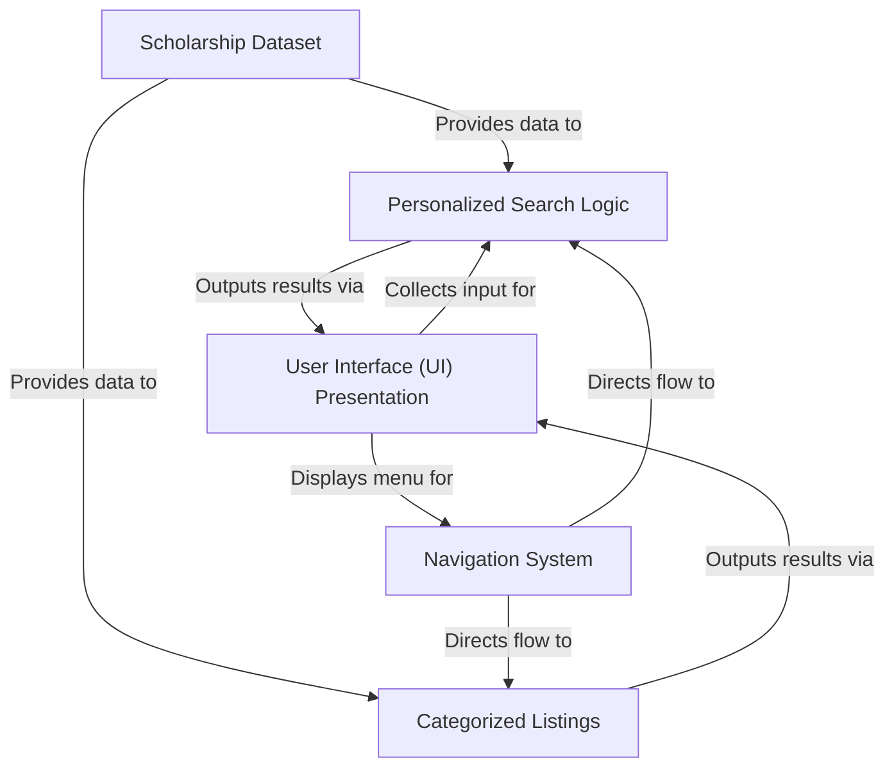

# Scholarship-Finder
Education has become costly. And thus we come up with an idea of “ Scholarship Finder “ where a needy can find a scholarship .Through this one can definitely fulfill their dreams of educating themselves at a lower cost.

Link for the website: https://aagam051-scholarship-finder-hackathon-t5joad.streamlitapp.com/

# Tutorial: Scholarship-Finder

This project is a **Scholarship Finder** application designed to help users find relevant scholarships.
It uses a central *Scholarship Dataset* and allows users to perform *personalized searches* based on their profile details.
It also provides *categorized listings* for browsing scholarships by specific criteria.
The *Navigation System* allows users to switch between finding methods and other sections, all presented through a simple *User Interface*.

## Visual Overview

## Chapters

1. [User Interface (UI) Presentation
](01_user_interface__ui__presentation_.md)
2. [Navigation System
](02_navigation_system_.md)
3. [Personalized Search Logic
](03_personalized_search_logic_.md)
4. [Categorized Listings
](04_categorized_listings_.md)
5. [Scholarship Dataset
](05_scholarship_dataset_.md)

---

Generated by [AI Codebase Knowledge Builder](https://github.com/The-Pocket/Tutorial-Codebase-Knowledge).

